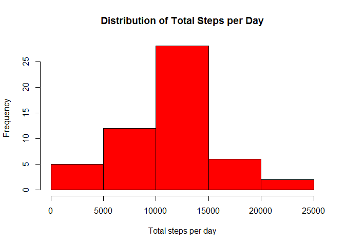
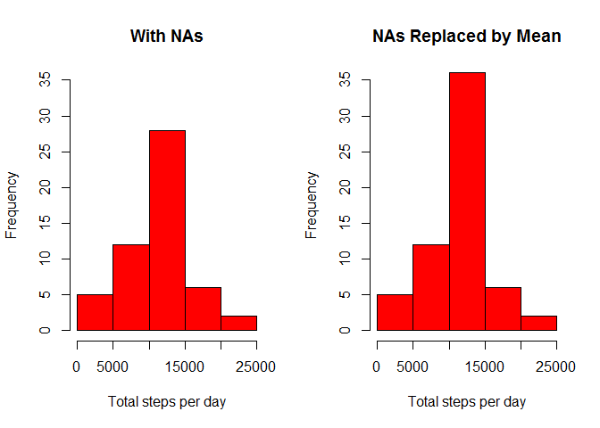

# Reproducible Research: Peer Assessment 1


## Loading and preprocessing the data
Unzip the file, if not already done so, then read it in.

```r
if (!(file.exists("activity.csv"))) { 
    unzip("activity.zip")
    }
activityData <- read.csv("activity.csv")
```

Make sure dates are interpreted as dates

```r
activityData$date <- as.Date(activityData$date, "%Y-%m-%d")
```

## What is mean total number of steps taken per day?
Calculate the total number of steps per day (note NAs are ignored by default in the aggregate function)

```r
stepsPerDay <- aggregate(steps ~ date, data=activityData, FUN=sum)
```

Histogram of total steps per day

```r
hist(stepsPerDay$steps, 
     main="Distribution of Total Steps per Day", 
     xlab = "Total steps per day", 
     col = "red"
     )
```

 

Now, calculate the mean and median number of steps per day.

```r
meanStepsPerDay <- as.character(round(mean(stepsPerDay$steps),2))
medianStepsPerDay <- median(stepsPerDay$steps)
```
The mean steps per day is **10766.19** and the median is **10765**

## What is the average daily activity pattern?
Calculate the average steps per 5-minute interval (averaged accross all days)

```r
stepsPerInterval <- aggregate(
    steps ~ interval, 
    data=activityData, 
    FUN=mean)
```
Plot a time-series of this information

```r
plot(stepsPerInterval, 
     type="l", 
     main="Average Number of Steps per 5-minute Interval",
     ylab="Average Number of Steps", 
     xlab="5-minute Interval", 
     col="red")
polygon(
    x=stepsPerInterval$interval, 
    y=stepsPerInterval$steps, 
    col="red")
```

 

Calculate the 5-minute interval containing the maximum average number of steps

```r
intervalOfMaxMeanSteps <- subset(
    stepsPerInterval, 
    subset=steps==max(stepsPerInterval$steps), 
    select=interval)$interval
```
The 5-minute interval is **835**

## Imputing missing values
1. Calculate and report the total number of missing values in the dataset (i.e. the total number of rows with NAs)

```r
missingDataTable <- table(is.na(activityData$steps))
totalEntries <- nrow(activityData)
missingEntries <- missingDataTable[["TRUE"]]
missingPercentage <- round(100*(missingEntries/totalEntries),1)
```
Out of 17568 entries, **2304** or **13.1%** are missing data.

2. Devise a strategy for filling in all of the missing values in the dataset. 
The strategy will be to use the mean value for the same time interval

3. Create a new dataset that is equal to the original dataset but with the missing data filled in.

First, append the mean steps per interval into a new data frame

```r
activityDataWithoutNA <- merge(
    x = activityData, 
    y=stepsPerInterval, 
    by="interval")
```

Calculate steps as the original, if not NA, and the mean if NA

```r
activityDataWithoutNA <- transform(
    activityDataWithoutNA, 
    steps=ifelse(is.na(steps.x), steps.y,steps.x)
    )
```

Now eliminate the extra columns to get a clean data set

```r
activityDataWithoutNA <- subset(
    activityDataWithoutNA, 
    select = c(steps,date,interval) 
    )
```

4. Make a histogram of the total number of steps taken each day and Calculate and report the mean and median total number of steps taken per day.


```r
stepsPerDayWithoutNA <- aggregate(
    steps ~ date, 
    data=activityDataWithoutNA, 
    FUN=sum)
```

Histogram of total steps per day

```r
par(mfcol = c(1,2))

hist(stepsPerDay$steps, 
     main="With NAs", 
     xlab = "Total steps per day", 
     col = "red",
     ylim=c(0,35)
 )

hist(stepsPerDayWithoutNA$steps, 
     main="NAs Replaced by Mean", 
     xlab = "Total steps per day", 
     col = "red",
     ylim=c(0,35)
     )
```

 


## Are there differences in activity patterns between weekdays and weekends?
